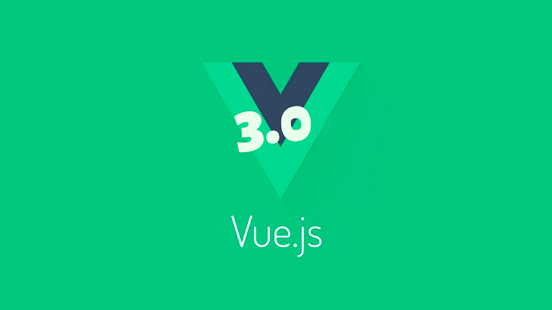

# 前言

Vue 3.0 从去年的组合式 API 征求意见一直至今9月来发布正式版本，让前端人不的不感叹：**学不动了 ！**

但是学不动了，还要学 🙃

本小册只是 Vue3.0 的一个入门级开发尝试，主要是对自己学习的一个记录与汇总，欢迎大家交流指正。

文档

- [Vue 3.0 官方文档](https://v3.vuejs.org/guide/introduction.html)
- [组合式 API 征求意见稿](https://composition-api.vuejs.org/zh/)
