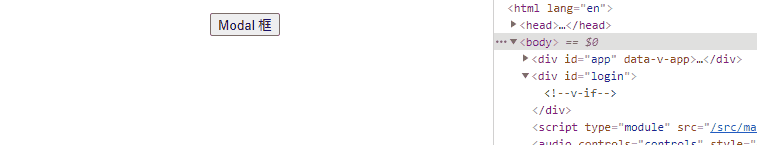

# Teleport 任意门

Vue 3.0 新增一个叫 `Teleport` 的 `api`，使用它可以让我们的组件模板插入到根节点 `#app` 以外的元素节点中去。

## 基本使用
创建 TeleportTest 组件，其中 `to` 就是你需要指向到任意位置的 `Dom`
```javascript
<template>
  <teleport to="#login">
    <div v-if="visible">
      <div class="modal">Modal 弹出来了</div>
      <button @click="onClick">关闭</button>
    </div>
  </teleport>
</template>

<script>
  import { ref } from 'vue'
  import { useLogin } from '../hooks'

  export default {
    props: {
      visible: Boolean
    },
    methods: {
      onClick() {
        this.$emit('update:visible', false)
      }
    },
  }
</script>
```
在 `index.html` 中新增节点
```javascript
<body>
  <div id="app"></div>
  <div id="login"></div> // 新增节点
  <script type="module" src="/src/main.js"></script>
</body>
```
`App.vue` 中引入组件
```javascript
<template>
  <div>
    <button class="loginer" @click="onLogin">Modal 框</button>
    <TeleportTest v-model:visible="visible"/>
  </div>
</template>

<script>
import TeleportTest from './components/TeleportTest.vue'
import { useLogin } from './hooks'

export default {
  components: {
    TeleportTest
  },
  setup() {
    const { onLogin, visible } = useLogin();
    return {
      visible,
      onLogin
    }
  }
}
</script>

```
新建 `hooks` 逻辑
```javascript
// hooks.js
import { ref } from 'vue'

export const useLogin = () => {
  const visible = ref(false);
  const onLogin = (type) => {
    console.log(type);
    visible.value = true;
    console.log(visible);
  }
  const onClose = () => {
    visible.value = false;
  }
  return {
    visible,
    onLogin,
    onClose
  }
}
```
实现效果如下：


