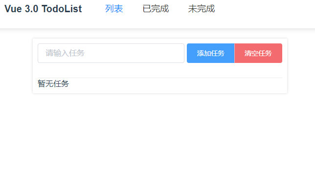
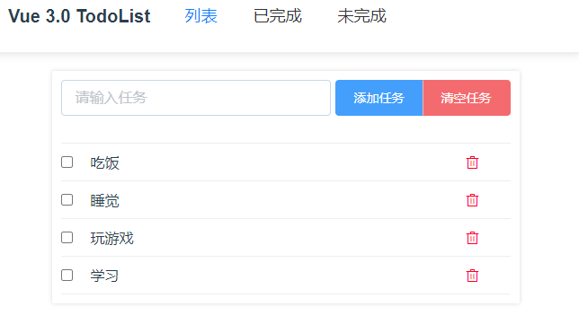

# 实战：TodoList

> TodoList [代码地址](https://github.com/one-pupil/study/tree/master/vue3-todolist)


了解了基本的使用，我们可以来实现一个 `TodoList` 项目，来更进一步的掌握 Vue 3.0 的基础使用
## 创建


创建项目我们还是使用 `vite`
```shell
yarn vite-app vue3-todolist
cd vue3-todolist
yarn 
yarn dev
```
我们在项目可能需要引入 `vuex` 和 `vue-router`，所以我们还要安装这两个依赖
```shell
yarn add vuex@next vue-router@next
```
## 任务列表与添加
这里直接上代码
```javascript
<template>
  <div class="task-add">
    <input v-model="task" class="el-input el-input__inner" type="text" placeholder="请输入任务">
    <div class="el-button-group">
      <button class="el-button el-button--primary" @click="addTask">添加任务</button>
      <button class="el-button el-button--danger" @click="clearTask">清空任务</button>
    </div>
  </div>
  <div class="task-list">
    <ul v-if="list.length">
      <li v-for="(item, index) in list" :key="index" class="task-list-item">
        <input type="checkbox" class="checkbox" v-model="item.completed">
        <p class="task-text" :class="{completed: item.completed}">{{ item.content }}</p>
        <i class="task-del el-icon-delete" @click="delTask(item.id)"></i>
      </li>
    </ul>
    <p v-else>
      暂无任务
    </p>
  </div>
</template>

<script>
import { reactive, toRefs } from 'vue'

export default {
  name: 'Home',
  setup() {
    const { list, task, addTask, clearTask, delTask } = useTaskList()

    return {
      task,
      list,
      addTask,
      clearTask,
      delTask
    }
  }
}

function useTaskList() {
  const state = reactive({
    list: [],
    task: ''
  })
  const addTask = () => {
    if (!state.task) {
      alert('任务必填')
      return
    }
    state.list.push({
      content: state.task,
      completed: false,
      id: new Date().getTime()
    })
    state.task = ''
  }
  const clearTask = () => {
    state.list = [];
  }
  const delTask = id => {
    const index = state.list.findIndex(v => v.id === id)
    state.list.splice(index, 1);
  }
  return {
    ...toRefs(state),
    addTask,
    clearTask,
    delTask
  }
}
</script>
```
我们看到 Vue 3.0 使用 Component API 来编写我们的代码时，`setup` 函数里面的逻辑可以更加的清晰，而且复用率可以更高。


来看看项目效果：

## 逻辑复用
我们接下来使用 `vuex` 来存储所有的任务列表数据，新建 `store.js` 文件
```javascript
import { createStore } from 'vuex'

export default createStore({
  state: {
    list: []
  },
  mutations: {
    getList(state, list) {
      state.list = list
    }
  },
  actions: {
    GetList({commit}, list) {
      commit('getList', list)
    }
  }
})
```
新建 `use-hook.js` 文件，提取函数 `useTaskList`，使用 `vuex` 存取列表数据
```javascript
import { reactive, toRefs } from 'vue'
import { useStore } from 'vuex'

export function useTaskList() {
  const store = useStore()
  const state = reactive({
    list: store.state.list,
    ...
  })
  const addTask = () => {
    ...
    store.dispatch('GetList', state.list)
  }
	...
}
```
再在已完成组件和未完成组件引入，这样我们就可以在任意组件中可以获取到任务列表数据
```javascript
import { computed, defineComponent } from 'vue';
import { useStore } from 'vuex';
import { useTaskList } from '../use-hook';

export default defineComponent({
  name: 'Completed',
  setup() {
    const { state: { list } } = useStore()
    const tasks = computed(() => list.filter(v => v.completed)) // 已完成任务
    const { delTask } = useTaskList()
    return {
      tasks,
      delTask
    }
  }
})
```
实现效果如下

